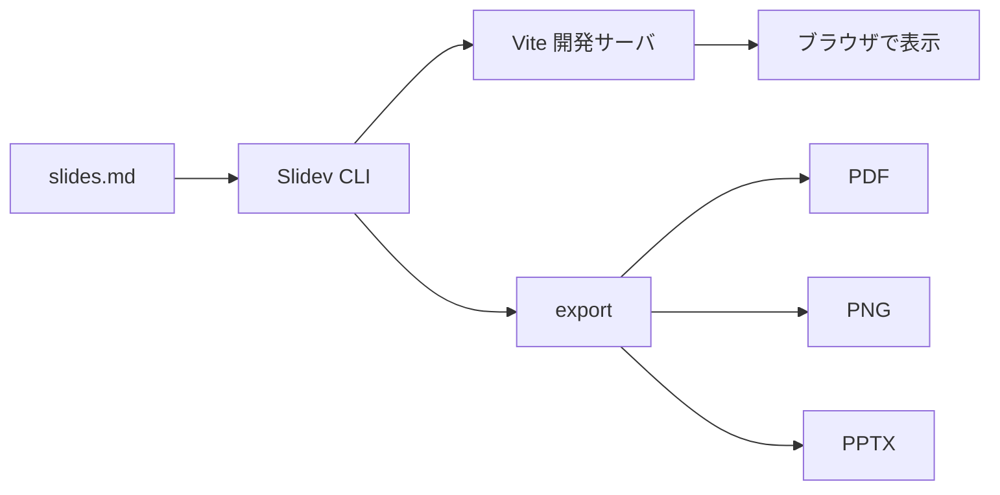

# Slidev 入門

Markdown で書く、開発者のためのスライド

<div class="pt-12">
  <span class="px-2 py-1 rounded opacity-70">
    Space / → で次へ
  </span>
</div>

<!--
発表者ノートはここに書く。発表者モードでだけ表示される。
-->

---

## Slidev とは

<v-clicks>

- **Markdown** でスライドを書くツール
- 中身は **Vite + Vue 3** で動く Web アプリ
- コードのハイライト、アニメーション、図表を標準で持つ
- テーマやアドオンを npm パッケージとして配れる
- PDF / PNG / **PPTX** に書き出せる

</v-clicks>

---
layout: two-cols
layoutClass: gap-8
---

## 始め方

```bash
# 新規作成
pnpm create slidev

# 既存プロジェクトに入れる
pnpm add -D @slidev/cli @slidev/theme-default

# 開発サーバを起動
pnpm slidev
```

::right::

## 画面

- `http://localhost:3030` で表示
- `/presenter` で発表者モード
- `/overview` で一覧
- ファイルを保存すると即座に反映（HMR）

---

## スライドの区切り方

`---` でスライドを区切り、直後の YAML で各スライドを設定します。

```md {1-4|6|8-11|all}
---
theme: default
title: 私の発表
---

# 1 枚目

---
layout: center
class: text-center
---

# 2 枚目
```

<v-click>

先頭の YAML（headmatter）はデッキ全体、以降はそのスライドだけに効きます。

</v-click>

---

## コードのハイライト

Shiki による色付けと、クリックごとの行強調ができます。

```ts {2|4-6|all}
interface Talk {
  title: string
  speaker: string
  duration: number
}

const talk: Talk = { title: 'Slidev 入門', speaker: 'Yuki', duration: 20 }
console.log(`${talk.title} (${talk.duration} min)`)
```

---

## アニメーション

<div class="grid grid-cols-3 gap-6 mt-10">
  <div v-click class="p-6 rounded-lg bg-blue-500/20 text-center">
    <div class="text-3xl">1</div>
    <div>v-click</div>
  </div>
  <div v-click class="p-6 rounded-lg bg-green-500/20 text-center">
    <div class="text-3xl">2</div>
    <div>v-after</div>
  </div>
  <div v-click class="p-6 rounded-lg bg-orange-500/20 text-center">
    <div class="text-3xl">3</div>
    <div>v-clicks</div>
  </div>
</div>

<div v-click class="mt-10 text-center">
  クリックのたびに要素を順に出せます
</div>

---

## 図を描く（Mermaid）



---

## 数式（KaTeX）

インライン $E = mc^2$ も、ブロックも書けます。

$$
\int_{-\infty}^{\infty} e^{-x^2}\,dx = \sqrt{\pi}
$$

---

## Vue コンポーネントを埋め込む

Markdown の中にそのまま Vue を書けます。

<div class="mt-6 text-center">
  <Counter />
</div>

```vue
<script setup>
import { ref } from 'vue'
const count = ref(0)
</script>

<template>
  <button @click="count++">count: {{ count }}</button>
</template>
```

`components/` に置いたファイルは自動で読み込まれます。

---
layout: two-cols
layoutClass: gap-8
---

## 主なレイアウト

| 名前 | 用途 |
|---|---|
| `default` | 通常 |
| `cover` | 表紙 |
| `center` | 中央寄せ |
| `two-cols` | 2 段組 |
| `image-right` | 右に画像 |
| `quote` | 引用 |
| `section` | 章の区切り |

::right::

## 設定例

```md
---
layout: image-right
image: /photo.jpg
---

# 画像つきスライド
```

---

## 書き出し

```bash
# PDF（既定）
pnpm slidev export

# PowerPoint
pnpm slidev export --format pptx

# 静的サイトとしてビルド
pnpm slidev build
```

<v-click>

> export には `playwright-chromium` が必要です。
> PPTX は各スライドを画像として貼るため、PowerPoint 上で文字の編集はできません。

</v-click>

---

## PPT 部品

Markdown の見出し・段落・箇条書き・表はそのままネイティブ書き出しされます。図形や座標指定が要るところだけ PPT 部品を使います。

<PptShape type="rightArrow" :x="60" :y="330" :w="140" :h="44" fill="#3b82f6" line="none" color="#ffffff">次へ</PptShape>

<PptText :x="230" :y="320" :w="300" fill="#eef2ff" :radius="8" :padding="12" name="lead">

**座標指定**のテキスト枠。`x` `y` を書かなければ実測配置になります。

</PptText>

<PptShape type="ellipse" :x="560" :y="320" :w="120" :h="64" fill="#fde68a" line="#b45309">楕円</PptShape>

<PptShape type="line" :x="60" :y="430" :w="620" :h="0" :line="{ color: '#94a3b8', width: 2, tail: 'arrow' }" />

<PptTable :x="720" :y="300" :rows="[['部品', '出るもの'], ['PptText', 'テキスト枠'], ['PptShape', '図形']]" />

---
layout: center
class: text-center
---

# ありがとうございました

[sli.dev](https://sli.dev)
