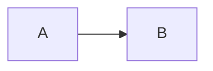

# 受入テスト

Markdown で書くスライド

<div class="pt-12">
  <span class="px-2 py-1 rounded opacity-70">
    裸のテキスト（div の中の span）
  </span>
</div>

<!--
ノート 1 行目
[click] ノート 2 行目
- 箇条書き
-->

---

## 箇条書きと書式

- **太字** と *斜体* と `コード`
- [外部リンク](https://sli.dev) と <a href="/3">3 枚目</a>
  - 入れ子 ~~取り消し~~ <u>下線</u> H<sub>2</sub>O x<sup>2</sup>
- <mark>マーク</mark>
- 箇条書きの中の表（W-LI-BLOCK）

  | a | b |
  |---|---|
  | 1 | 2 |

1. 番号 1
2. 番号 2

<div v-click class="mt-4">クリックの文（v-click は装飾を持たない div）</div>


<a href="https://sli.dev">

</a>

---
layout: two-cols
layoutClass: gap-8
---

## 2 段組の左

```ts {2}
const a = 1
  return a
```

::right::

## 右の見出し

- 右の箇条書き

> 引用の段落

---

## 表と線

| 名前 | 用途 |
|---|:-:|
| `default` | 通常 |
| cover | 表紙 |

***

段落のあとの表（区切りブロックで枠が割れる）

---

## 数式と図

インライン $E = mc^2$ を含む段落。

$$
\int_0^1 x\,dx = \frac{1}{2}
$$



---

## 装飾つきの箱と未知の要素

<div class="grid grid-cols-2 gap-6">
  <div class="p-6 rounded-lg bg-blue-500/20 text-center">
    <div class="text-3xl">1</div>
    <div>塗りのある箱（規則 13）</div>
  </div>
  <div class="p-6 rounded-lg bg-green-500/20 shadow-lg">
    <div>影つき（W-CSS）</div>

```ts
const inside = 'box'
```

  </div>
</div>

<div class="mt-4"><button class="px-3 py-1 border">未知の要素（規則 15）</button></div>

<div style="background-image: linear-gradient(90deg, #f00, #00f); width: 200px; height: 20px"></div>

<!-- 静的な src="/missing.png" は Vite が import に変換して解決に失敗し、スライドごと 500 になる。動的束縛なら変換されない -->


<div data-ppt-export="image">

```ts
const image = 'この部分は画像'
```

</div>

<div data-ppt="text" data-ppt-export="native" data-ppt-name="handwritten" data-ppt-opts='{}' data-ppt-box='{"x":600,"y":400,"w":300}'>

手書きの `data-ppt`（規則 2 の代用）

</div>

---
layout: center
class: text-center
---

# 中央

中央の段落

---
layout: section
---

# 章の区切り（対応表に無い）

---
layout: image-right
image: /bg.png
---

## 右に画像

左の本文

---
layout: cover
background: /bg.png
---

# 背景画像つきの表紙

副題

---
zoom: 0.8
---

## zoom のスライド

縮小されている本文

---

## はみ出し

<div style="position:absolute; left:-40px; top:200px; width:200px; background:#eeeeee">左にはみ出した箱</div>
<div style="position:absolute; left:900px; top:300px; width:200px; background:#eeeeee">右にはみ出した箱</div>
<div style="position:absolute; left:-300px; top:400px; width:100px; background:#eeeeee">完全に外（W-HIDDEN）</div>
<div style="opacity:0">見えない</div>
<div style="position:absolute; left:300px; top:380px; width:300px; height:40px; overflow:hidden; background:#eeeeee">
  溢れる本文 1 行目<br>2 行目<br>3 行目<br>4 行目<br>5 行目<br>6 行目（W-OVERFLOW）
</div>
